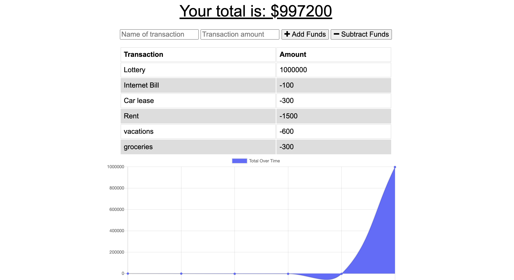

# Budget Tracker

## Description
This Budget Tracker node app allows user to track and manage their budget. The application is a progressive web app. It is still accessible if the user looses connection and updates as soon as the connection is back. 

Link to deployed application on Heroku: [Deployed Application](https://obscure-everglades-51844.herokuapp.com/)

## Screenshots
Budget Tracker Dashboard

Offline indexedDB

## License
 MIT License
 Copyright (c) [2020] [Pierre Pariente Dimitrov]

## Badge
 

## Contributing
 Learn more by reading the [Contributor Covenant](./CODE_OF_CONDUCT.md) file.
